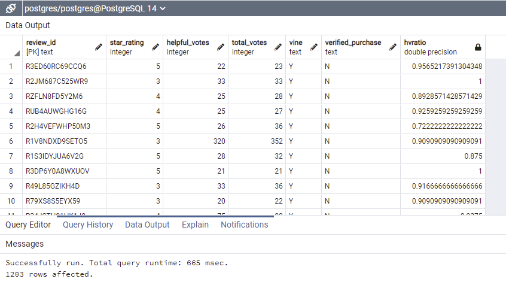
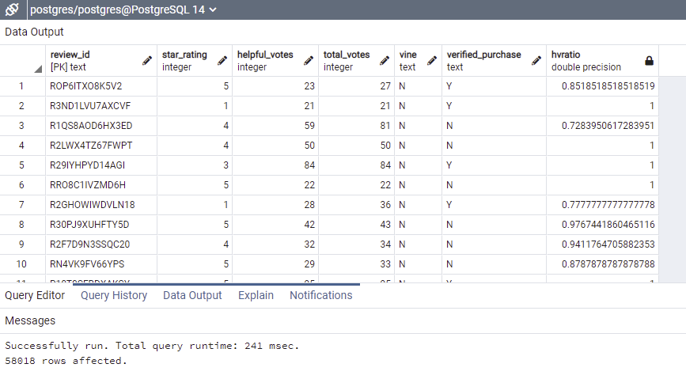

# Amazon_Vine_Analysis
## The purpose of this Analysis is to see if Amazon reviews are biased based on whether they are paid or not

### For this assignment we have criteria of: using products that have 20 or more votes, and those reviews have been flagged as helpful more than 50% of the time.

This changes the dataset from 
4,864,249 for whole table
65,871 for just total_votes>20
59,221 for just total_votes>20 and xx>0.5(helpful-votes)

And with the last part of the where clause we can separate the 60 thousand-ish rows into two groups
There are 1,203 Vine Reviews, and 58,018 non-vine reviews

The first Image below shows the query to obtain this information so far (in comments are the row totals)

These two images show the separate results for the select queries above.

---
### Next, we use the tables we created above. 
A CommonTableExpression is wrapped around a union, inside each of the unioned queries we use Case statements to create a column with 1 or 0 and then total them up. a group by is not need since there are no additional columns to carry through.
For the results we select columns we created with the CTE and use a calculated column to get a percentage.

This query is show below, the final result is shown below that 

The Query: 

Final Result: 

To state results, we can say:

*  1,203 Vine reviews
* 58,018 Non-Vine reviews
*    410 Five Star Vine reviews
* 28,043 Five Star Non-Vine Reviews
* 34.08% Vine review are 5 star
* 48.33% Non-Vine reviews are 5 star

## In summary I believe there is a small amount of bias, possibly due to non-paid reviewers only making a review if they are very pleased, or very upset with the product.  A paid reviewer would give a review even if the product is average in their opinion.
I would be eager to try this analysis with the exclusion set to 1 or more votes instead of 20.
Additionally it would be helpful to break-out the analysis to include whether the review was on a verified purchase or not.
