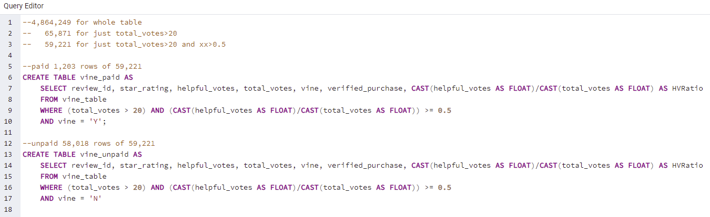
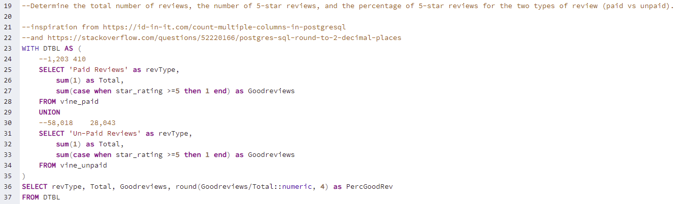
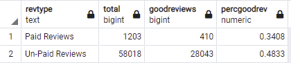

# Amazon_Vine_Analysis
## The purpose of this Analysis is to see if Amazon reviews are biased based on wheather they are paid or not

### With the given criteria of using product that have 20 or more votes, and those prodcuts have reviews, that have been flagged as helpfull more than 50% of the time.
We can see the following

A dataset of 4.8 Million Products is now trimmed down to just under 60 Thousand reviews.

